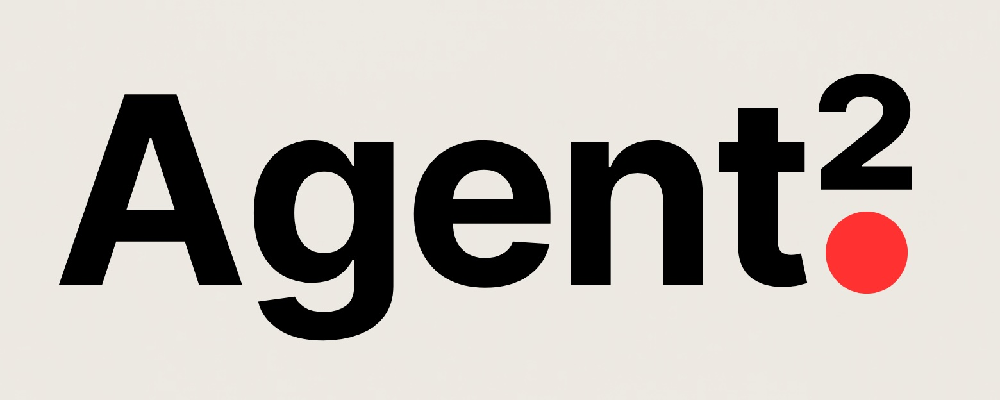

# Agent2



**Turn domain experts into production AI agents.**

Not just how they think — how they work. The tools, the books, the memory, the judgment calls.

## Quick start

The intended v0.3 flow is:

```bash
curl -fsSL https://getagent2.dev/install.sh | bash
agent2 onboard
```

The hosted `getagent2.dev` script is a deployment target. The repo already ships
the installer locally:

```bash
git clone https://github.com/duozokker/agent2.git
cd agent2
scripts/install.sh
agent2 onboard
```

This does three things:

- `agent2 setup` writes `.env` and `agent2.yaml`, picks the model, configures
  Docker profile and telemetry, and backs up existing config files before
  replacing them.
- `agent2 onboard` runs the Brain Clone onboarding harness. The LLM may help
  shape the interview into an `AgentSpec`, but only deterministic Python
  templates write files.
- `agent2 doctor` checks Docker, uv, config files, compose validity, ports, and
  local health endpoints.

You can also run the steps manually:

```bash
uv sync --extra dev
uv run agent2 setup
uv run agent2 onboard
uv run agent2 doctor
```

For non-interactive generation from a checked-in spec:

```bash
uv run agent2 onboard --from-spec tests/fixtures/roofing-agent-spec.json --no-llm
uv run agent2 serve roofing-field-advisor
```

Your expert is now a local Agent2 API. Auth, typed output, knowledge search,
memory, human approval, mock mode, and Docker wiring are generated with it.

Open the repo in Claude Code, Codex, Cursor, OpenCode, or another AI coding tool
when you want to extend the generated agent. `AGENTS.md`, `llms.txt`, and the
skills in `.claude/skills`, `.codex/skills`, `.gemini/skills`, and
`.github/skills` teach coding agents the Agent2 pattern.

---

## What Agent2 does

Every company has domain experts whose knowledge is trapped in their heads. An accountant who knows which DATEV account to use. A lawyer who spots the risky clause. A compliance officer who catches the violation.

Agent2 clones their entire workplace into an AI agent:

```
What we clone                         How
─────────────────────────────────────────────────────────
How the expert thinks                 Sachbearbeiter Chain-of-Thought prompt
What tools they use                   Tool integrations (DB, email, lookups)
Which books they read                 Knowledge search (R2R collections)
What they remember                    Persistent memory between sessions
When they ask for help                Pause/resume + clarifying questions
What needs sign-off                   Sandbox tools + human approval
What they produce                     Pydantic-validated typed output
```

The result is a production HTTP service — not a chatbot, not a prompt wrapper. A typed API you call a million times.

---

## Feature matrix

| Feature | What it does | Demo agent | Docs |
|---|---|---|---|
| **Full Brain Clone pattern** | Expert workspace, books, memory, approvals, resume, evals | [procurement-compliance-officer](./agents/procurement-compliance-officer) | [Brain Clone Pattern](./docs/brain-clone-pattern.md) |
| **Typed outputs** | Pydantic model as `output_type`, auto-retry on validation failure | [support-ticket](./agents/support-ticket) | [Creating Agents](./docs/creating-agents.md) |
| **Sync + async execution** | `mode=sync` for inline, `mode=async` for queued work with polling | [invoice](./agents/invoice) | [Getting Started](./docs/getting-started.md) |
| **Pause / resume** | Serialized `message_history` for multi-turn conversations | [resume-demo](./agents/resume-demo) | [Resume](./docs/resume-conversations.md) |
| **Human approval** | `pending_actions` + host-driven execution | [approval-demo](./agents/approval-demo) | [Approvals](./docs/approvals.md) |
| **Provider routing** | `provider_order` + `provider_policy` for cache-aware routing | [provider-policy-demo](./agents/provider-policy-demo) | [Provider Policy](./docs/provider-policy.md) |
| **Tool scoping** | Per-run tool interception and collection filtering | [scoped-tools-demo](./agents/scoped-tools-demo) | [Capabilities](./docs/capabilities.md) |
| **Knowledge search** | R2R + FastMCP for shared document collections | [rag-test](./agents/rag-test) | [Knowledge](./docs/knowledge-management.md) |
| **Observability** | Langfuse traces, prompt management, cost tracking | — | [Observability](./docs/observability.md) |
| **Mock mode** | Full API without an LLM key — returns schema-compliant mock data | [code-review](./agents/code-review) | [Getting Started](./docs/getting-started.md) |

---

## Build your first agent manually

Most users should start with `agent2 onboard`. Manual scaffolding is useful when
you already know the framework internals.

### 1. Copy the template

```bash
cp -r agents/_template agents/my-agent
```

### 2. Define your output

```python
# agents/my-agent/schemas.py
from pydantic import BaseModel, Field

class InvoiceSummary(BaseModel):
    vendor: str = Field(description="Vendor name")
    total: float = Field(gt=0, description="Total amount in EUR")
    account_code: str = Field(description="Suggested booking account")
    confidence: float = Field(ge=0.0, le=1.0)
```

### 3. Create the agent

```python
# agents/my-agent/agent.py
from shared.runtime import create_agent
from .schemas import InvoiceSummary

agent = create_agent(
    name="my-agent",
    output_type=InvoiceSummary,
    instructions=(
        "You are an experienced accountant with 20 years in practice. "
        "When you receive an invoice, think step by step: "
        "What kind of document is this? Check the client file. "
        "Validate formal requirements. Look up the right account. "
        "If anything is unclear, ask."
    ),
)

@agent.tool_plain
def lookup_vendor(name: str) -> dict:
    """Check if this vendor exists in our database."""
    return {"known": True, "default_account": "6805"}
```

### 4. Expose the API

```python
# agents/my-agent/main.py
from shared.api import create_app
app = create_app("my-agent")
```

That's it. Your agent now has a production HTTP API with auth, rate limiting, structured output, async execution, and error handling.

---

## Why not X?

| Alternative | What it solves | What Agent2 adds |
|---|---|---|
| **"You are an expert" prompts** | A system prompt | The full expert: Sachbearbeiter Chain-of-Thought prompt, tools, knowledge search, memory, human approval, typed output with validation |
| **PydanticAI alone** | Agent loop, structured output, tool calls | The production runtime: HTTP API, auth, async queue, pause/resume, approvals, provider routing |
| **LangChain / LangServe** | Prompt orchestration, chain composition | Task-centric execution (not conversation-centric), typed output enforcement, approval workflows |
| **CrewAI / AutoGen** | Multi-agent coordination | Single-agent production deployment — one agent, one schema, one endpoint. Orchestrate multiple Agent2 services if you need multi-agent |
| **OpenClaw** | Personal AI agent on your laptop | Enterprise backend agents — HTTP-callable, multi-tenant, typed outputs, scalable on any container platform |
| **Building it yourself** | Full control | You skip writing ~3000 LOC of framework code: auth, error handling, async queue, message history serialization, approval workflow, provider routing, mock mode, dual layout detection |

---

## Stack

Agent2 stays close to the ecosystem instead of reinventing it:

| Layer | Technology | Why |
|---|---|---|
| Agent runtime | [PydanticAI](https://ai.pydantic.dev/) | Structured output, tool use, retries, model-agnostic |
| HTTP API | [FastAPI](https://fastapi.tiangolo.com/) | Auth, rate limiting, async, OpenAPI docs |
| LLM provider | [OpenRouter](https://openrouter.ai/) | Any model — Claude, Gemini, GPT, Llama — one API key |
| Knowledge search | [R2R](https://github.com/SciPhi-AI/R2R) + [FastMCP](https://github.com/jlowin/fastmcp) | Document ingestion, hybrid search, reranking via MCP |
| OCR | [Docling](https://github.com/docling-project/docling) | PDF extraction, table recognition, layout analysis |
| Observability | [Langfuse](https://langfuse.com/) | Traces, prompt registry, cost tracking, evals |
| Eval testing | [Promptfoo](https://promptfoo.dev/) | Pre-deploy regression testing for agent behavior |
| Task queue | Redis | Async task state, polling |
| Infra | Postgres, ClickHouse, MinIO | R2R storage, Langfuse backend |

---

## Default vs. full stack

**Default** (`docker compose up -d`) — fast developer loop:
- Postgres, Redis, Langfuse
- example-agent, support-ticket, code-review, invoice, approval-demo, resume-demo, provider-policy-demo

**Full** (`docker compose --profile full up -d`) — complete platform:
- Everything above + R2R, Docling, Temporal, Knowledge MCP
- rag-test, scoped-tools-demo, procurement-compliance-officer

---

## Documentation

| Topic | Link |
|---|---|
| Architecture | [docs/architecture.md](./docs/architecture.md) |
| CLI Onboarding | [docs/cli-onboarding.md](./docs/cli-onboarding.md) |
| Brain Clone Pattern | [docs/brain-clone-pattern.md](./docs/brain-clone-pattern.md) |
| Sachbearbeiter Reference Pattern | [docs/reference-agents/sachbearbeiter-pattern.md](./docs/reference-agents/sachbearbeiter-pattern.md) |
| Getting Started | [docs/getting-started.md](./docs/getting-started.md) |
| Creating Agents | [docs/creating-agents.md](./docs/creating-agents.md) |
| Capabilities | [docs/capabilities.md](./docs/capabilities.md) |
| Resume and Conversations | [docs/resume-conversations.md](./docs/resume-conversations.md) |
| Approvals | [docs/approvals.md](./docs/approvals.md) |
| Provider Policy | [docs/provider-policy.md](./docs/provider-policy.md) |
| Knowledge Management | [docs/knowledge-management.md](./docs/knowledge-management.md) |
| Observability | [docs/observability.md](./docs/observability.md) |
| Deployment and Scaling | [docs/deployment.md](./docs/deployment.md) |
| When to use Agent2 | [docs/comparison.md](./docs/comparison.md) |

---

## AI-assisted development

Agent2 ships with built-in skills for AI coding tools. Open this repo in Claude Code, Cursor, Codex, or Gemini CLI and your agent already knows how to work with the framework.

| Skill | What it does | Trigger |
|---|---|---|
| **brain-clone** | Interactive interview that extracts expert knowledge and generates a complete agent | "brain clone", "clone expert", "create domain expert" |
| **creating-agents** | Scaffolds a complete agent service | "new agent", "scaffold agent" |
| **building-domain-experts** | Patterns for knowledge-backed document processing agents | "expert agent", "document processing" |
| **adding-knowledge** | R2R collections, ingestion, per-tenant knowledge scoping | "add knowledge", "add books", "RAG" |
| **adding-capabilities** | Pause/resume, approvals, provider routing, tool scoping | "add resume", "add approval" |
| **debugging-agents** | Systematic diagnosis for framework issues | "agent doesn't work", "500 error" |

Skills follow the [open SKILL.md standard](https://agents.md/) and are available in `.claude/skills/`, `.codex/skills/`, `.gemini/skills/`, and `.github/skills/`.

---

## Design principles

- **Framework code lives in `shared/`.** Product logic lives in agent modules.
- **Capabilities are opt-in.** Pause/resume, approvals, knowledge, tool scoping — use what you need.
- **Prompts are code-first.** Langfuse is optional for iteration and observability, not a requirement.
- **Errors are RFC 7807.** Every failure returns `application/problem+json`.
- **No lock-in.** Standard Python, standard Docker, standard FastAPI. Deploy anywhere.

---

## Status

Agent2 provides production-tested primitives for turning domain expertise into AI agents — born from real enterprise work processing millions of documents for German tax firms.

Current release target: **v0.3.0** (pre-release, CLI onboarding in progress)

### What's here

- Typed agent creation with `create_agent()`
- Full HTTP API with `create_app()`
- Sync and async task execution
- Pause/resume with serialized message history
- Human-in-the-loop approval workflows
- Provider-aware execution with cache routing
- Tool interception and collection scoping
- Mock mode for development without LLM keys
- 56 unit tests covering framework primitives and onboarding
- GitHub Actions CI with lint + test + Docker verify
- 5 built-in skills for AI coding tools (Claude Code, Codex, Gemini CLI, Copilot)

### Roadmap

- [ ] PyPI package (`pip install agent2`)
- [ ] Agent2 Cloud (managed hosting + dashboard)
- [x] CLI for setup, onboarding, diagnostics, and generated-agent checks
- [ ] Agent2 Studio UI for non-technical domain experts
- [ ] Multi-agent orchestration primitives
- [ ] WebSocket streaming for long-running tasks
- [ ] Plugin system for community agent templates
- [ ] Brain Clone marketplace (pre-built expert templates)
- [ ] Domain expert interview UI

---

## Built by Artesiana

Agent2 was born from production work at [Artesiana](https://artesiana.de), where we turn domain expertise into AI agents. The framework has powered 4M+ processed documents and $160k+ in revenue since September 2025.

We're open-sourcing the core because we believe the infrastructure for cloning domain experts should be a shared foundation, not a proprietary moat.

---

## Built with Agent2

### MandantLink — Autonomous invoice processing for tax firms

[MandantLink](https://mandantlink.de) turns a 20-year accounting veteran's expertise into an AI agent that processes invoices end-to-end: OCR → knowledge-backed analysis → clarifying questions → human approval → DATEV export. Built with Agent2's expert cloning pattern.

> **Have you built something with Agent2?** Open a PR to add your project here.

## License

[MIT](./LICENSE)
